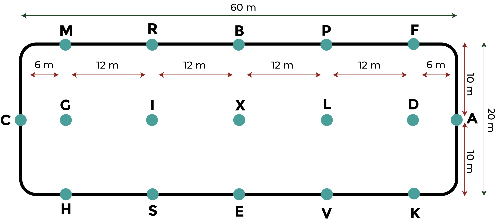

# Moonshot Project

Table of Contents

- [Moonshot Project](#moonshot-project)
  - [What problem my project is solving?](#what-problem-my-project-is-solving)
  - [Why this problem is worth solving?](#why-this-problem-is-worth-solving)
  - [How I am going to solve this problem?](#how-i-am-going-to-solve-this-problem)
  - [Glossary](#glossary)

## What problem my project is solving?

My project is for the equestrian professional, specifically for horse riding trainers and riders. As a rider for many years, I have encountered many difficulties that can now be solved by technologies. One of the most difficulty in the equestrian community is the abstract side of the dressage. It is an equestrian discipline where the rider and the horse work together to achieve precise and harmonious movements. These movements are executed on a rectangular dressage arena with letters placed at the corners to guide the rider in their routine. The discipline focuses on precision, elegance, and communication between the rider and the horse. Dressage competitions are judged based on the quality of the movements executed and the fluidity of the performance. A dressage routine includes many elements such as circles, curves, and changes of pace.

The difficulty of this discipline lies in its abstract nature, as the rider must have a clear mental representation of their routine and the movements he wants to execute but also, precision in their requests in order to communicate the correct information to their horse. This requires the rider to be rigorous in their posture, balance, and requests. Indeed, when a rider wishes to perform a dressage routine, they have two aids at their disposal: their routine and the markers in the arena. In official competitions, the only visual markers available to the rider are the dressage letters placed in the arena, although in some cases, it is possible for someone to dictate the routine to the rider.

- By clicking on this [link](https://www.ffe.com/pratiquer/disciplines/dressage), you will be directed to the official website of the French Equestrian Federation where you can find all the official dressage routines in the various drop-down menus labeled **"Reprise"**. You can also navigate on this page to find other information about this discipline.

- These are the dressage markers for a 60 x 20 meter dressage arena. The distances presented are official and never vary. The letters on the centerline (G, I, X, L, D) are not indicated on the arena; they are imaginary markers. The other official size for a dressage arena is 40 x 20 meters.

## Why this problem is worth solving?

The equestrian world is nowadays more and more connected but nothing has been developed to help riders or/and trainers in there physical tasks which has an effect on their physical condition and morale.
There are a number of reasons why developing a solution to analyze the rider's routine might be considered a problem worth solving:

- **Autonomy:** It can be difficult for riders to know if they have correctly executed their movements without the help of a dressage coach or judge. That is why a smart assistant to analyze dressage movements can be an interesting solution.

- **Precision:** Better understanding the mistakes riders make and correcting them more quickly would allow them to progress more rapidly and achieve their goals more easily.

- **New perspectives:** This could also make the discipline more accessible to a wider audience, as riders would be able to track their progress more easily without the need for a coach all the time. Therefore, solving this problem could improve the experience of practicing dressage for riders and allow the discipline to continue to evolve, modernize, and grow.

## How I am going to solve this problem?

To solves this problem, I have envisioned a solution capable of analyzing the rider's track using various sensors. Some of them will be placed on the dressage letters to recreate the arena, while another one will be in motion, placed on the saddle, and communicating with the sensors of the letters to have the exact position of the rider within the area delimited by the dressage letters and compare the rider's trajectory with the original routine.

The main challenges of this project are:

- Data collection
- Data analysis

## Glossary

<!-- | Words              	| Definitions                                                                                                                                                                                   	| Sources                                                                                                                                	|
|--------------------	|-----------------------------------------------------------------------------------------------------------------------------------------------------------------------------------------------	|----------------------------------------------------------------------------------------------------------------------------------------	|
| Polework exercises 	| It is basic exercise in horse riding to increase your horse’s strength and flexibility, improve their ability to engage the hindquarters, and make their paces more expressive and cadenced. 	| [International Federation for Equestrian Sports](https://www.fei.org/stories/lifestyle/teach-me/3-polework-exercises-strengthen-horse) 	| -->
